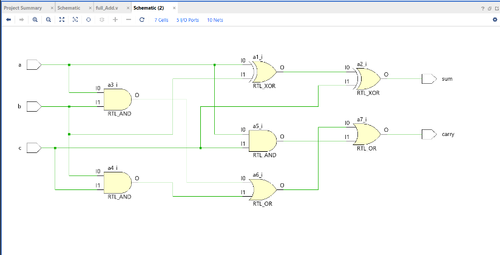
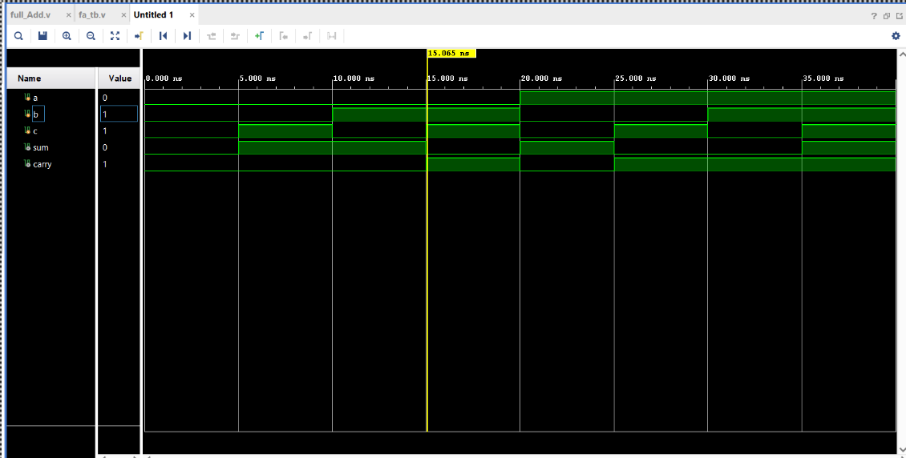
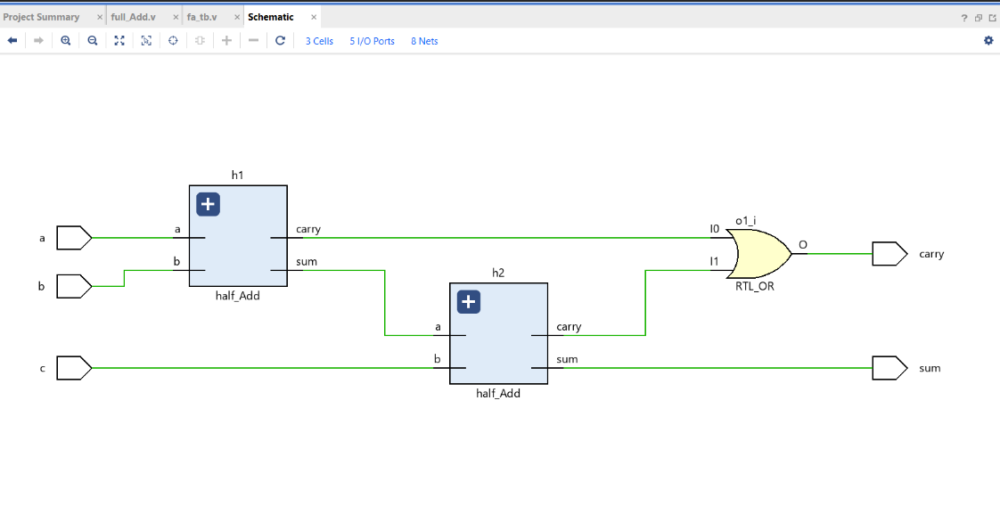
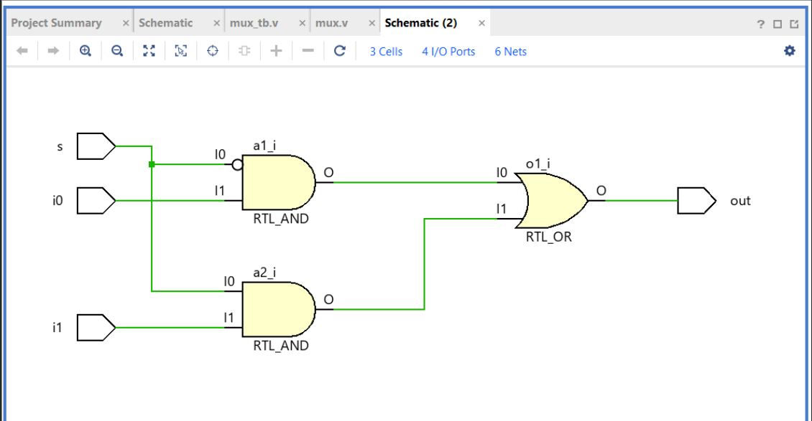
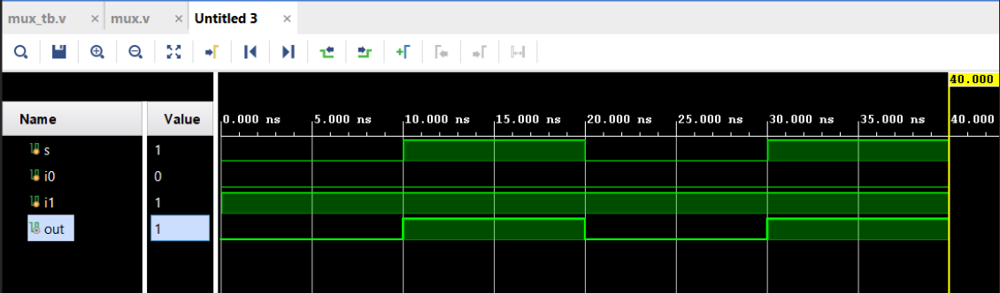
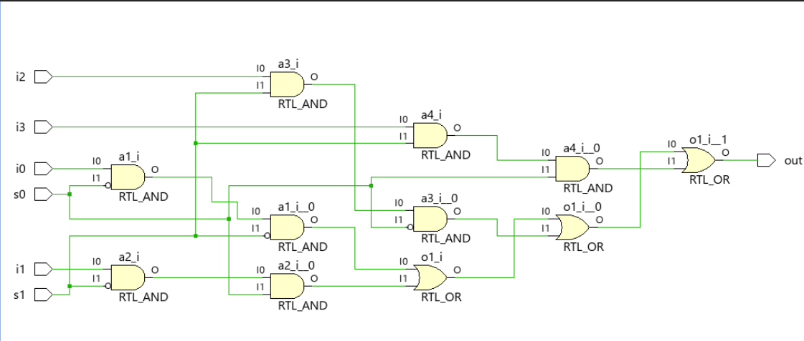
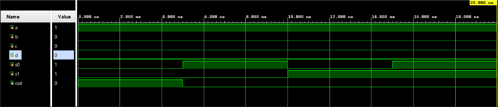
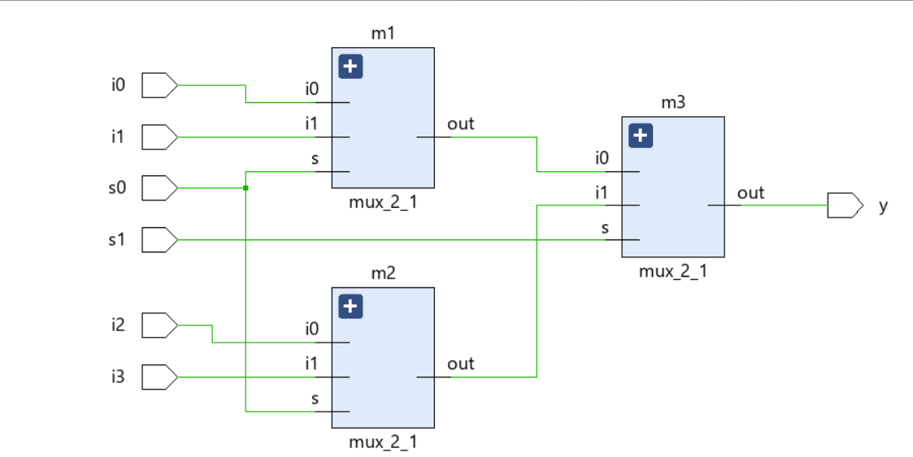
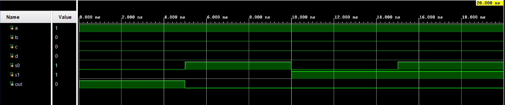
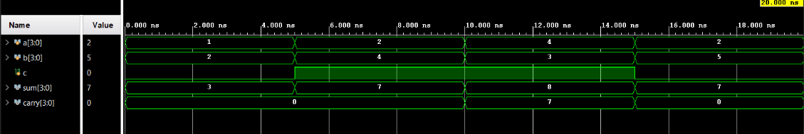

## Full adder using gates 
```verilog
module fa(a,b,c,sum,carry); 

  input a,b,c; 

  output sum,carry; 

  wire x1,x2,x3,x4,x5; 

  xor a1(x1,a,b); 

  xor a2(sum,x1,c); 

  and a3(x2,a,b); v

  and a4(x3,b,c); 

  and a5(x4,a,c); 

  or a6(x5,x2,x3); 

  or a7(carry,x5,x4); 

endmodule 
```
## Full adder using data flow 
```verilog
module fadf(a,b,c,sum,carry); 

  input a,b,c; 

  output sum,carry; 

  assign sum=a^b^c; 

  assign carry = ((a&b) | (b&c) | (a&c)); 

endmodule 
```
### Test Bench
```verilog
module fa_tb; 

  reg a; 

  reg b; 

  reg c; 

  wire sum,carry; 

  fa_ha tb(a,b,c,sum,carry); 

  initial begin 

    a=0; b=0; c=0; 

    #5; 

    a=0; b=0; c=1; 

    #5; 

    a=0; b=1; c=0; 

    #5; 

    a=0; b=1; c=1; 

    #5; 

    a=1; b=0; c=0; 

    #5; 

    a=1; b=0; c=1; 

    #5 

    a=1; b=1; c=0; 

    #5; 

    a=1; b=1; c=1; 

    #5 $finish; 

  end 

    always @(a or b  or c) 

    $display("time=%0t, a=%b, b=%0b,c=%0b, Sum=%d, Carry=%d",$time, a,b,c, sum, carry); 

  initial 

  begin 

    $dumpfile("dump.vcd"); 

    $dumpvars(1); 

  end  

endmodule 
```



## Full adder using half adder 
```verilog
module ha(a,b,sum,carry); 

  input a,b; 

  output reg sum, carry; 

  assign sum = a^b; 

  assign carry =a&b; 

endmodule 

      module fa_ha(input a,b,c,output sum,carry); 

      wire x,y,z; 

      ha h1(.a(a),.b(b),.sum(x),.carry(y)); 

      ha h2(.a(x),.b(c),.sum(sum),.carry(z)); 

      or o1(carry,y,z); 

    endmodule 
```
### Test bench 
```verilog
module fa_tb; 

  reg a; 

  reg b; 

  reg c; 

  wire sum,carry; 

  fa_ha tb(a,b,c,sum,carry); 

   

  initial begin 

    a=0; b=0; c=0; 

    #5; 

    a=0; b=0; c=1; 

    #5; 

    a=0; b=1; c=0; 

    #5; 

    a=0; b=1; c=1; 

    #5; 

    a=1; b=0; c=0; 

    #5; 

    a=1; b=0; c=1; 

    #5 

    a=1; b=1; c=0; 

    #5; 

    a=1; b=1; c=1; 

    #5 $finish; 

  end 

    always @(a or b  or c) 

    $display("time=%0t, a=%b, b=%0b,c=%0b, Sum=%d, Carry=%d",$time, a,b,c,sum, carry); 

  initial 

  begin 

    $dumpfile("dump.vcd"); 

    $dumpvars(1); 

  end  

endmodule 
```


## Design a 2x1 MUX
```verilog
module mux_2_1(input s,i0,i1,output out); 

  wire x,y,z; 

  not n1(x,s); 

  and a1(y,x,i0); 

  and a2(z,s,i1); 

  or o1(out,y,z); 

endmodule 
```
### Testbench
```verilog
module mux_2_1_tb; 

  reg s,i0,i1; 

  wire out; 

  mux_2_1 tb(s,i0,i1,out); 

  initial begin 

    i0=0; 

    i1=1; 

    s=0; 

    #40 $finish; 

  end 

    always #10 s=~s; 

  always @(s) 

    $display("time=%0t, sel=%b, i0=%b, i1=%0b, Output=%b",$time,s,i0,i1,out); 

  initial 

  begin 

    $dumpfile("dump.vcd"); 

    $dumpvars(1); 

  end  

endmodule 
```



## Design a 4x1 MUX
```verilog
module mux_4_1(input i0,i1,i2,i3,s0,s1,output out); 

  wire s0bar,s1bar,p,q,r,s; 

  not n1(s0bar,s0); 

  not n2(s1bar,s1); 

  and a1(p,i0,s0bar,s1bar); 

  and a2(q,i1,s1bar,s0); 

  and a3(r,i2,s1,s0bar); 

  and a4(s,i3,s1,s0); 

  or o1(out,p,q,r,s); 

endmodule 
```
### Testbench
```verilog
module mux_4_1_tb; 

  reg a,b,c,d; 

  reg s0,s1; 

  wire out; 

  mux_4_1 tb(.i0(a),.i1(b),.i2(c),.i3(d),.s0(s0),.s1(s1),.out(out)); 

   

  initial begin 

    a=1; b=0; c=0; d=0; 

     

    s1=0; s0=0; 

    #5; 

    s1=0; s0=1; 

    #5; 

    s1=1; s0=0; 

    #5; 

    s1=1; s0=1; 

    #5 $finish; 

  end 

  always @(s1 or s0) 

    $display("time=%0t, i0=%b, i1=%0b,i2=%0b,i3=%0b, s1=%0b, s0=%0b, Output=%d",$time,a,b,c,d,s1,s0,out); 

  initial 

  begin 

    $dumpfile("dump.vcd"); 

    $dumpvars(1); 

  end  

endmodule 
```



## Design 4x1 MUX using 2x1 MUX
```verilog
module mux_2_1(input s,i0,i1,output out); 

  wire x,y,z; 

  not n1(x,s); 

  and a1(y,x,i0); 

  and a2(z,s,i1); 

  or o1(out,y,z); 

endmodule 

 

module mux_4_1(input i0,i1,i2,i3,s0,s1,output y); 

  wire a,b; 

  mux_2_1 m1(s0,i0,i1,a); 

  mux_2_1 m2(s0,i2,i3,b); 

  mux_2_1 m3(s1,a,b,y); 

endmodule 
```
### TestBench
```verilog
module mux_4_1_tb; 

  reg a,b,c,d; 

  reg s0,s1; 

 wire out; 

 mux_4_1 tb(.i0(a),.i1(b),.i2(c),.i3(d),.s0(s0),.s1(s1),.y(out)); 

  initial begin 

    a=1; b=0; c=0; d=0; 

    s1=0; s0=0; 

    #5; 

    s1=0; s0=1; 

    #5; 

    s1=1; s0=0; 

    #5; 

    s1=1; s0=1; 

    #5 $finish; 

  end 

  always @(s1 or s0) 

    $display("time=%0t, i0=%b, i1=%0b,i2=%0b,i3=%0b, s1=%0b, s0=%0b, Output=%d",$time,a,b,c,d,s1,s0,out); 

  initial 

  begin 

    $dumpfile("dump.vcd"); 

    $dumpvars(1); 

  end  

endmodule 
```



## Half Subtractor
```verilog
module hs(a,b,diff,bo); 

  input a,b; 

  output diff, bo; 

  assign diff = a^b; 

  assign bo = ~a&b; 

endmodule 
```
### Testbench
```verilog
module hs_tb; 

  reg a; 

  reg b; 

  wire diff,bo; 

  hs tb(a,b,diff,bo); 

  initial begin 

    a=0; b=0;  

    #5; 

    a=0; b=1;  

    #5; 

    a=1; b=0;  

    #5; 

    a=1; b=1;  

    #5 $finish; 

  end 

    always @(a or b ) 

      $display("time=%0t, a=%b, b=%0b, Diff=%d, Borrow=%d",$time, a,b, diff, bo); 

  initial 

  begin 

    $dumpfile("dump.vcd"); 

    $dumpvars(1); 

  end  

endmodule 
```
## Full Subtractor
```verilog
module fs(input a,b,c, output diff,bo); 

  wire x,p,q,r,s,t; 

  not n1(x,a); 

  xor x1(p,a,b); 

  xor x2(diff,p,c); 

  and a1(q,x,b); 

  and a2(r,x,c); 

  and a3(s,b,c); 

  or o1(t,q,r); 

  or o2(bo,t,s); 

endmodule 
```
### Testbench
```verilog
module fs_tb; 

  reg a,b,c; 

  wire diff,bo; 

  fs tb(a,b,c,diff,bo); 

  initial begin 

    a=0; b=0; c=0; 

    #5; 

    a=0; b=0; c=1; 

    #5; 

    a=0; b=1; c=0; 

    #5; 

    a=0; b=1; c=1; 

    #5; 

    a=1; b=0; c=0; 

    #5; 

    a=1; b=0; c=1; 

    #5; 

    a=1; b=1; c=0; 

    #5; 

    a=1; b=1; c=1; 

    #5; 

  end 

  initial $monitor("Time=%0d,a=%b,b=%b,c=%b,diff=%b,borrow=%b",$time,a,b,c,diff,bo); 

endmodule 
```
## Ripple Carry Adder 
```verilog
module rca(a,b,cin,sum,cout); 

  input [7:0]a; 

  input [7:0]b; 

  input cin; 

  output [7:0] sum; 

  output [7:0] cout; 

  wire c1,c2,c3,c4,c5,c6,c7; 

   

  fa n1(a[0],b[0],cin,sum[0],cout[0]); 

  fa n2(a[1],b[1],cout[0],sum[1],cout[1]); 

  fa n3(a[2],b[2],cout[1],sum[2],cout[2]); 

  fa n4(a[3],b[3],cout[2],sum[3],cout[3]); 

  fa n5(a[4],b[4],cout[3],sum[4],cout[4]); 

  fa n6(a[5],b[5],cout[4],sum[5],cout[5]); 

  fa n7(a[6],b[6],cout[5],sum[6],cout[6]); 

  fa n8(a[7],b[7],cout[6],sum[7],cout[7]); 

   

endmodule 

 

module fa(input a,b,cin,output sum,cout); 

  wire w1,w2,w3,w4,w5; 

  xor x1(w1,a,b); 

  xor x2(sum,w1,cin); 

  and a1(w2,a,b); 

  and a2(w3,b,cin); 

  and a3(w4,a,cin); 

  or o1(w5,w2,w3); 

  or o2(cout,w4,w5); 

endmodule 
```
### TestBench
```verilog
module rca_tb; 

  reg[7:0] a; 

  reg[7:0] b; 

  reg cin; 

  wire [7:0] sum; 

  wire cout; 

  rca tb(a,b,cin,sum,cout); 

  initial begin 

    a=2; b=3; cin=0; 

    #5; 

    a=2; b=4; cin=1; 

    #5; 

    a=5; b=5; cin=0; 

    #5; 

    a=9; b=1; cin=1; 

    #5; 

    a=3; b=4; cin=0; 

    #5; 

    a=7; b=2; cin=1; 

    #5 

    a=8; b=3; cin=0; 

    #5; 

    a=2; b=2; cin=1; 

    #5 $finish; 

  end 

  always @(a or b  or cin) 

    $display("time=%0t, a=%0d, b=%0d,c=%0d, Sum=%d, Carry=%d",$time, a,b,cin, sum, cout); 

  initial 

  begin 

    $dumpfile("dump.vcd"); 

    $dumpvars(1); 

  end  

endmodule 
```
## D Flip flop
```verilog
module dff(clk,clear,enable,din,q); 

input [7:0]din; 

input clk,clear,enable; 

output reg [7:0]q; 

always @(posedge clk) 

    if(enable)begin 

        if(clear) 

            q <= 0; 

        else  

            q <= din; 

    end 

endmodule
```
### TestBench
```verilog
module dff_tb; 

  reg din; 

  reg clk,clear,enable; 

  wire  q; 

   

  dff tb(clk,clear,enable,din,q); 

  initial begin 

    din=0; 

    clk=0; 

    clear=0; 

    enable=1; 

  end 

   

  always #3 clk =~clk; 

  always #5 din =~din; 

  initial #50 $stop; 

   

    always @(din or clk) 

      $display("Time = %0t, Clk=%0b, D=%0b , Q=%0b", $time,clk,din,q); 

 

    initial 

  begin 

    $dumpfile("dump.vcd"); 

    $dumpvars(1); 

  end  

endmodule 
```

## Ripple carry adder using generate and parameter
```verilog
module fa(input a,b,c, output sum, carry); 

  assign sum = a^b^c; 

  assign carry = ((a&b)|(b&c)|(a&c)); 

endmodule 

 

module rip #(parameter SIZE = 4) 

  (input[SIZE-1 : 0] a,b,input c,output[SIZE-1 : 0] sum,carry); 

   

  fa a1(a[0],b[0],c,sum[0],carry[0]); 

   

  genvar i; 

  generate 

  for (i=1;i<SIZE;i = i + 1) begin 

    fa a1(a[i],b[i],carry[i-1],sum[i],carry[i]); 

 end 

  endgenerate 

endmodule 
```
### TestBench
```verilog
module rip_tb; 

  reg[3:0] a,b; 

  reg c; 

  wire[3:0] sum; 

  wire[3:0] carry; 

  rip tb(a,b,c,sum,carry); 

  initial begin 

    a=1; b=2; c=0; 

    #5; 

    a=2; b=4; c=1; 

    #5; 

    a=4; b=3; c=1; 

    #5; 

    a=2; b=5; c=0; 

    #5 $finish; 

  end 

    always @(a or b  or c) 

    $display("time=%0t, a=%0d, b=%0d,c=%0d, Sum=%0d, Carry=%0d",$time, a,b,c, sum, carry[3]); 
endmodule 
```
